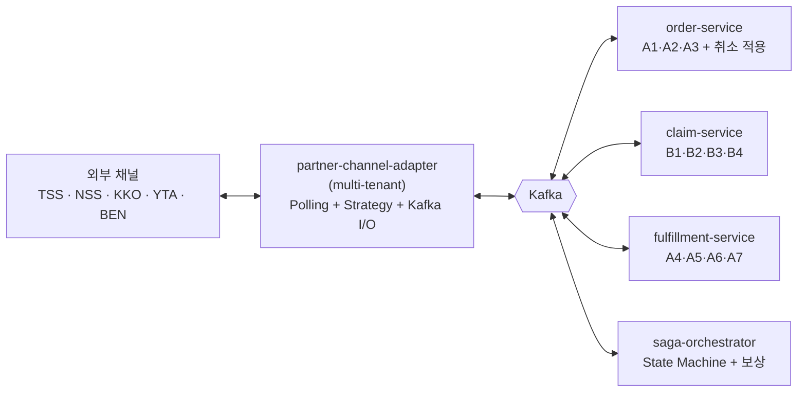
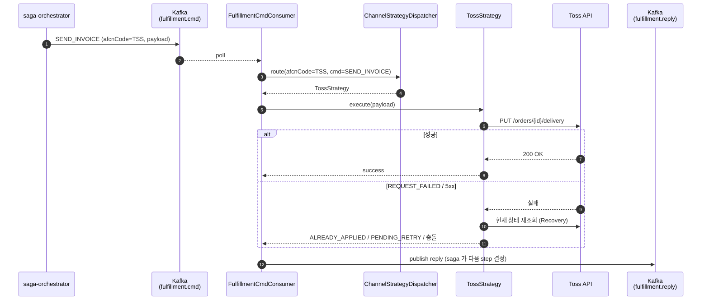

# ADR-0002 — 서비스 분할 / 채널 어댑터 구성

- **Status**: Proposed (다듬는 중)
- **Date**: 2026-06-08
- **Deciders**: 황명권
- **Related**: [ADR-0001](0001-saga-style.md), [docs/as-is/toss-shopping.md](../as-is/toss-shopping.md), [README](../../README.md)

---

## Context

본 프로젝트 정체성은 "다중 서비스 + 분산 SAGA + Outbox + 멱등성" (CLAUDE.md). 0단계 합의 직후 단계로, 다음을 결정해야 한다.

1. 서비스 분할 축 — 도메인 vs 채널 vs 패턴(현행 msg/batch)
2. 채널 어댑터 구성 — per-channel vs multi-tenant
3. Phase 전략 — 처음부터 잘게 vs 단계적
4. Kafka 의 위치와 토픽 분할 기준 (개략 — 세부는 ADR-0003 로 분리)

본 ADR 은 ADR-0001 의 안 ("오케 메인 + 후행 코레오, SAGA 코디네이터는 별도 서비스 가능") 을 가정한다. ADR-0001 Q3 (코디네이터 배치) 가 다르게 결정되면 본 ADR 의 saga-orchestrator 분리도 재정렬한다.

---

## Decision (안 — 다듬는 중)

### 분할 축

- **분할 축은 도메인** (order / claim / fulfillment). 채널이 아니다.
- **채널은 도메인 안의 "외부 시스템 어댑터 구현체"** 로 처리 — ACL(Anti-Corruption Layer) 패턴.

### 채널 어댑터 구성

- **Multi-tenant**: `partner-channel-adapter` **1 Spring Boot** 에 TSS / NSS / KKO / YTA / BEN 등 채널 strategy 다 들어감.
- 현행 `OrdrLinkageServiceFinder` 의 dispatch 패턴이 그대로 이전.
- 채널 트래픽 격리가 필요한 채널만 차후 분리 (하이브리드).

### Phase 전략

| Phase | 서비스 구성 | 의도 |
|---|---|---|
| **Phase 0** (첫 코드) | 3 Spring Boot: `partner-channel-adapter` + `core-service` (Modulith) + `saga-orchestrator` | 채널 ACL 만 먼저 분리. 도메인은 한 서비스 안에 모듈로 시작. 분할 학습 비용 ↓ |
| **Phase 1** (확장) | 5 Spring Boot: core-service 를 `order-service` / `claim-service` / `fulfillment-service` 로 분리 | 모델 안정 후 도메인 분할. 본 정체성 달성 |
| **Phase 1+ (선택)** | + `notification-service` / `analytics-service` (코레오 후행 구독) | ADR-0001 의 부분 하이브리드 안 채택 시 |

### Kafka 위치

- 서비스 간 모든 동기/비동기 통신은 Kafka 기반. 직접 HTTP 호출 금지(원칙).
- 토픽 분할 축 = **도메인** (옵션 A). 채널 격리는 파티션 키(`afcnCode`) 로 일차 해결, 필요 시 채널별 토픽 분리(ADR-0003).

---

## Service Topology (Phase 1 기준)



Phase 0 에서는 `order-service` / `claim-service` / `fulfillment-service` 가 `core-service` 한 서비스 안의 모듈로 존재한다.

---

## `partner-channel-adapter` 내부 구조

채널별 strategy 외에 **공통 Inbound/Outbound Kafka 컴포넌트 + 채널 polling** 이 한 Spring Boot 에 함께 들어간다.

```
┌──────────────────────────────────────────────────────────────────┐
│         partner-channel-adapter (1 Spring Boot)                   │
│                                                                    │
│  ─── Inbound (외부 → 내부) ──────────────────────────────────────  │
│  ┌──────────────────────────────────────────────────────────┐    │
│  │ Channel Polling Schedulers (channel-specific @Scheduled) │    │
│  │  - Toss: SearchOrder / RetryWaitOrder / SearchClaim      │    │
│  │  - NSS / KKO / YTA / BEN : 동일 패턴                     │    │
│  └────────────────┬─────────────────────────────────────────┘    │
│                   ▼ 채널별 외부 API 호출 (Feign)                  │
│  ┌──────────────────────────────────────────────────────────┐    │
│  │ Inbound Translator → Kafka Producer                      │    │
│  │   raw → Domain Event 변환 → publish (order.events.in 등) │    │
│  └──────────────────────────────────────────────────────────┘    │
│                                                                    │
│  ─── Outbound (내부 → 외부) ─────────────────────────────────────  │
│  ┌──────────────────────────────────────────────────────────┐    │
│  │ Common Kafka Consumers (channel-agnostic)                │    │
│  │  - OrderCommandConsumer    ← order.cmd                   │    │
│  │  - ClaimCommandConsumer    ← claim.cmd                   │    │
│  │  - FulfillmentCmdConsumer  ← fulfillment.cmd             │    │
│  └────────────────┬─────────────────────────────────────────┘    │
│                   ▼ afcnCode + commandType 로 dispatch            │
│  ┌──────────────────────────────────────────────────────────┐    │
│  │ ChannelStrategyDispatcher (EnumMap / SPI)                │    │
│  │   ┌────────┬────────┬────────┬────────┬────────┐         │    │
│  │   │ Toss   │ Nss    │ Kko    │ Yta    │ Ben    │         │    │
│  │   │Strategy│Strategy│Strategy│Strategy│Strategy│         │    │
│  │   └───┬────┴───┬────┴───┬────┴───┬────┴───┬────┘         │    │
│  └──────┼────────┼────────┼────────┼────────┼──────────────┘    │
│         ▼        ▼        ▼        ▼        ▼                    │
│       Toss     NSS      KKO      YTA      BEN  (외부 API)        │
│                                                                    │
│  ─── Common Cross-cutting ───────────────────────────────────────  │
│   토큰 캐시(Redis) · RateLimiter · ErrorDecoder · Recovery        │
│   · API 호출 이력(Mongo) · Outbox Publisher                       │
└──────────────────────────────────────────────────────────────────┘
```

**대표 흐름 (Outbound — 송장 등록 예)**



---

## Service Responsibility (Phase 1 기준)

| 서비스 | 책임 | 현행 매핑 (As-Is 카탈로그 참조) |
|---|---|---|
| **partner-channel-adapter** | 외부 채널 모든 IO. 인바운드 폴링 + 아웃바운드 Strategy + 토큰/RateLimit/Recovery/이력 | `Tss·Nss·…·OutAdapter` (msg) + `TssOrderScheduler` 외 (batch) + <external-common-lib> 의 채널 Client |
| **order-service** | 주문 aggregate — A1·A2·A3 + 취소 적용 (B2 의 사내 EOH 반영 부분) | `TssOrderReceptionService` + `EohRegistrationService` + `CancelReqService` (주문 측면) |
| **claim-service** | 클레임 aggregate — B1·B2·B3·B4 (수신/승인/거절/완료/철회) | `TssReceiveClmService` + `ClaimReqService` + `Return·ExchangeCompleteService` + `Return·ExchangeRejectService` |
| **fulfillment-service** | 물류 aggregate — A4 송장 / A5 발송지연 / A6 자동품절 / A7 BCT·매출, 'E' 재시도 흐름 | `ModifyDeliveryService` + `SoldoutService` + `SendOrderToBctService` + `SaleRegistrationService` |
| **saga-orchestrator** | 상태머신 + 보상 트리거 + step 라우팅 | 현행 없음 — 신규 |
| (선택) notification-service | 알림 (SMS/카톡/메일) — 코레오 후행 구독 | 현행 미상 — 비범위 가능성 (Open Question) |
| (선택) analytics-service | 통계/감사 — 코레오 후행 구독 | 현행 미상 — 비범위 가능성 |

**Phase 0 의 `core-service`** 는 위 order/claim/fulfillment 책임을 **Modulith 내부 모듈** 로 분리해서 시작. 패키지 경계로 의존 방향을 강제해 Phase 1 분리 비용을 낮춤.

---

## Kafka Topic Strategy (개략)

세부 명세는 ADR-0003 으로 분리. 본 ADR 은 분할 축만 결정.

| 토픽 | 용도 | Producer | Consumer | 파티션 키 |
|---|---|---|---|---|
| `order.events.in` | 외부 수신 신규 주문 이벤트 (A1) | partner-channel-adapter | order-service, saga-orchestrator | `orderProductId` |
| `claim.events.in` | 외부 수신 클레임 이벤트 (B1) | partner-channel-adapter | claim-service, saga-orchestrator | `claimId` |
| `order.cmd` | 주문 도메인 명령 (Saga → adapter / 도메인) | saga-orchestrator | partner-channel-adapter, order-service | `orderProductId` |
| `claim.cmd` | 클레임 도메인 명령 | saga-orchestrator | partner-channel-adapter, claim-service | `claimId` |
| `fulfillment.cmd` | 물류 명령 (송장/지연/품절/BCT) | saga-orchestrator | partner-channel-adapter, fulfillment-service | `orderProductId` |
| `{domain}.events.out` | 도메인 사실 발행 (코레오 후행 구독용) | order/claim/fulfillment-service | notification, analytics (Phase 1+) | 도메인 키 |
| `saga.reply` | 도메인/어댑터 → Saga 결과 | adapter / 도메인 | saga-orchestrator | sagaId |

**분할 축 — 옵션 비교**

| 옵션 | 형태 | 채택 |
|---|---|---|
| **A. 도메인별** | `order.cmd` / `claim.cmd` / `fulfillment.cmd` | ★ 채택 |
| B. 채널별 | `toss.cmd` / `nss.cmd` / ... | 미채택 — 도메인 dispatch 가 분산됨 |
| C. 도메인 × 채널 | `order.toss.cmd` / ... | 미채택 — 토픽 폭증 |

채널 격리는 일차로 파티션 키 `afcnCode` 로, 필요 시 ADR-0003 에서 부분 분리.

---

## Consequences

**(+) 이점**
- 도메인 vs 채널 ACL 분리 명확 — 신 채널 추가 비용 = strategy 1개 추가
- 현행 multi-tenant 패턴을 그대로 흡수 → 학습/이전 비용 ↓
- Kafka 토픽 도메인 축 = Saga / 도메인 서비스 / 어댑터 축 모두 일치
- Phase 0 로 학습 부담 ↓, Phase 1 분리로 본 정체성 달성
- 채널 모드/스펙 차이를 도메인이 알 필요 없음

**(−) 비용/위험**
- partner-channel-adapter 가 폴링 + 송신 + 다중 채널 = **한 서비스에 책임 多 / SPOF 위험**
- Phase 0 → Phase 1 마이그레이션 비용 (한 번 더 분리)
- saga-orchestrator 분리 시 HA / 상태 영속화 인프라 필요 (Kafka offset + DB)
- 토픽 도메인 축 → 채널 트래픽 격리 약함. 파티션 키 + DLQ + 채널별 컨슈머 스레드로 보완
- ChannelStrategy 가 늘어나면 한 서비스의 의존성/SDK 충돌 위험 — 패키징 격리 필요

---

## Open Questions

다음 라운드에서 다듬을 항목.

1. **Phase 0 의 `core-service` 가 Modulith 로 충분한가?** — 처음부터 도메인 분리로 가야 학습이 더 명확한지 검토
2. **ChannelStrategy 인터페이스 형태** — Spring Bean by-name? EnumMap? Java `ServiceLoader`? (현행은 EnumMap 기반 ServiceFinder)
3. **후행성(notification/analytics) 분리 시점** — Phase 0 부터 분리? Phase 1+ 로 미룸? (ADR-0001 Q1 — 오케 일관 vs 하이브리드 — 와 연결)
4. **saga-orchestrator 배치** — 별도 서비스 vs 도메인 서비스 내장 (ADR-0001 Q3 와 연결). 본 ADR 은 별도 서비스 가정
5. **partner-channel-adapter 의 폴링 분리** — 인바운드 폴링을 별도 batch 서비스로 분리하는 안 검토 (`partner-channel-poller` + `partner-channel-adapter`). 현행 <external-msg-app> / <external-batch-app> 분리 구조 참고
6. **Phase 0 → Phase 1 전환 트리거 기준** — 시점/조건 (예: 도메인 모델이 안정되었다고 판단하는 기준)
7. **Kafka 토픽 세부 명세 / 채널 격리 정책** — ADR-0003 으로 분리. 채널별 분리 토픽 추가 여부 결정 필요

---

## References

- [ADR-0001 — SAGA 스타일](0001-saga-style.md)
- [docs/as-is/toss-shopping.md](../as-is/toss-shopping.md) — 현행 카탈로그
- [README](../../README.md) — 진행 단계
- 메모리: `project_tss_saga_assessment`, `reference_modulith_survey` (Modulith 비교)
- Chris Richardson, *Microservices Patterns* (2018) — ACL 패턴 / Saga Pattern
