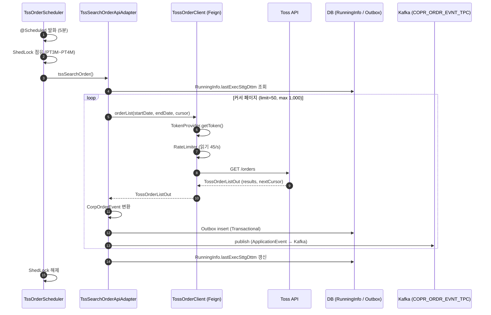
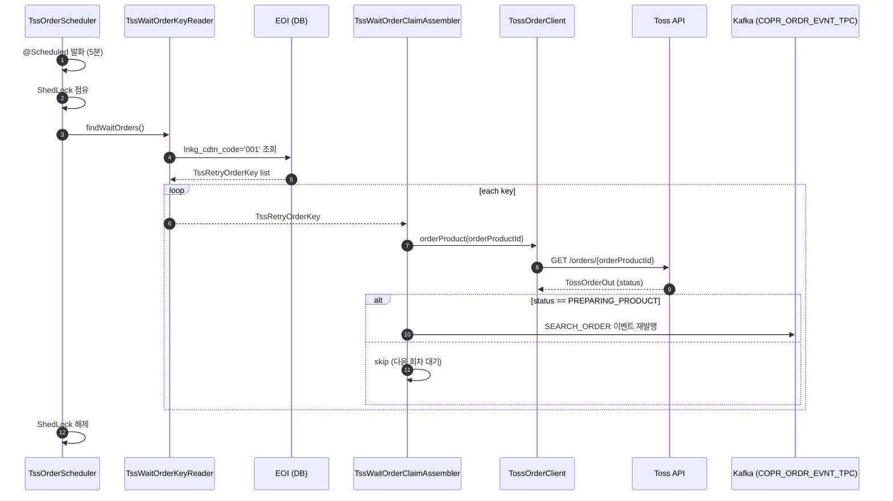
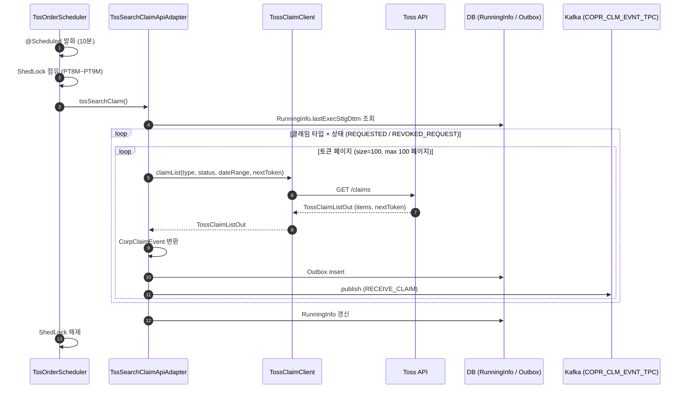
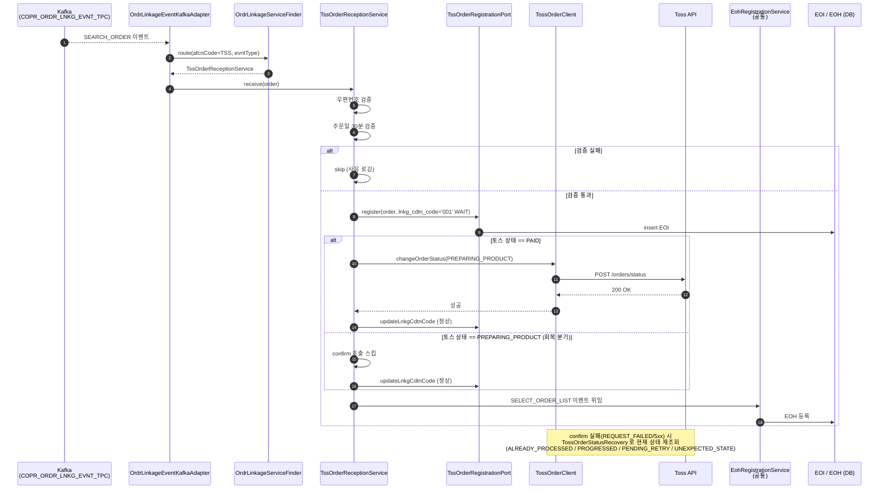
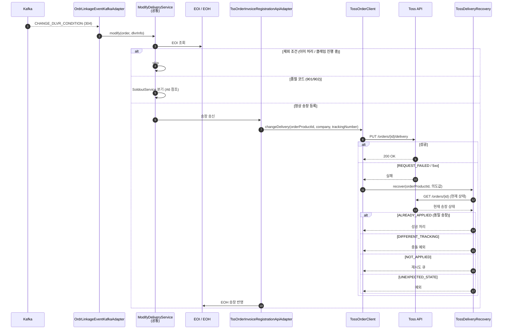
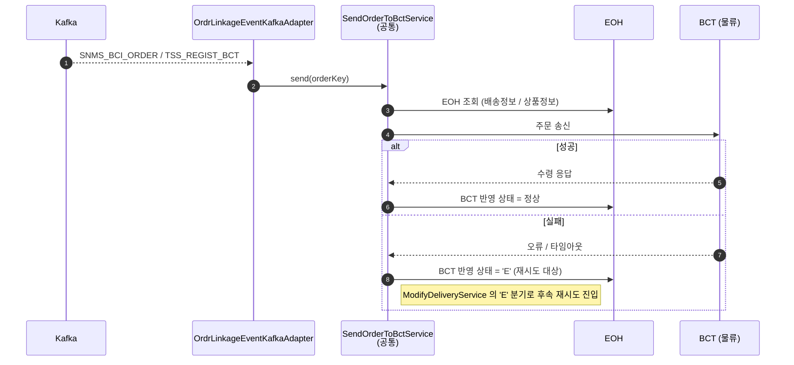

# 토스쇼핑 채널 현행 업무 명세 (As-Is)

- **상태**: 진행 중 — 우선 영역 4개(외부 수신 주문/클레임, 내부 주문 생성, 물류 전송) 상세화. 나머지는 차후 라운드.
- **작성일**: 2026-06-08
- **목적**: `partner-channel-msa` 가 다룰 토스쇼핑 채널의 현행 업무 전수를 코드 기반으로 정리. 도메인 aggregate / 서비스 분할 설계의 기반 자료.
- **출처 (Sibling Repo)**
  - `<sibling: 외부 메시지 처리 (참고, 제거됨)>` — 메시지 처리
  - `<sibling: 외부 배치 (참고, 제거됨)>` — 배치
  - `<sibling: 공통 lib (참고, 제거됨)>` — 공통 라이브러리

---

## 1. 업무 카탈로그 (전수)

### A. 주문(Order) 흐름 — 7개

| # | 업무 | 트리거 | 출처 |
|---|---|---|---|
| A1 | 주문 수신 (Toss → 자사) | batch 5분 폴링 + msg 처리 | batch `TssOrderScheduler.tssSearchOrder` / msg `TssOrderReceptionService` |
| A2 | 주문 WAIT 회복 (`lnkg_cdtn_code='001'` 재폴링) | batch 5분 폴링 | batch `TssOrderScheduler.tssRetryWaitOrder` / `TssRetryWaitOrderBundle` |
| A3 | EOI → EOH 등록 | msg 내부 | msg `EohRegistrationService` (공통) |
| A4 | 송장 등록 (자사 → Toss) | msg 이벤트(304) | msg `ModifyDeliveryService` + `TssOrderInvoiceRegistrationApiAdapter` |
| A5 | 발송지연 통보 | batch 일 15:00 + msg(307) | batch `OrderScheduler.deliveryDelayProcess` / msg `TssOrderDelaySendApiAdapter` |
| A6 | 자동품절 통보 | batch 일 10:00 + msg(901/902) | batch `OrderScheduler.autoSoldOut` / msg `SoldoutService` + `TssSellerCancelApiOutAdapter` |
| A7 | 북시티(BCT) 연동 / 매출 생성 | msg 내부 | msg `SendOrderToBctService` / `SaleRegistrationService` (공통) |

### B. 클레임(Claim) 흐름 — 4개

| # | 업무 | 트리거 | 출처 |
|---|---|---|---|
| B1 | 클레임 통합 폴링 (REQUESTED / REVOKED_REQUEST) | batch 10분 | batch `TssOrderScheduler.tssSearchClaim` / `TssSearchClaimApiAdapter` |
| B2 | 취소(CANCEL) 처리 — 수신/승인/거절/판매자취소 | batch 1분 + msg | batch `OrderScheduler.cancelClaim` / msg `TssReceiveClmService` + `CancelReqService` + `TssCancelApproveApiOutAdapter` / `TssCancelDenyApiOutAdapter` |
| B3 | 반품(RETURN) 처리 — 수신/승인/거절(2단계)/완료(2단계)/철회 | batch 4분 + msg | batch `OrderScheduler.returnExchangeClaim` / msg `TssReceiveClmService` + `ClaimReqService` + `TssReturnDenyApiOutAdapter` + `TssReturnCompleteApiOutAdapter` + `ReturnCompleteService` + `ReturnRejectService` |
| B4 | 교환(EXCHANGE) 처리 — 수신/승인/거절(2단계)/완료(3단계)/철회 | batch 4분 + msg | batch `OrderScheduler.returnExchangeClaim` / msg `TssReceiveClmService` + `TssExchangeDenyApiOutAdapter` + `TssExchangeCompleteApiOutAdapter` + `ExchangeCompleteService` + `ExchangeRejectService` |

### C. 횡단 인프라 (<external-common-lib>) — 5개

| # | 업무 | 출처 |
|---|---|---|
| C1 | OAuth2 토큰 발급/캐싱 (Redis + 분산 락) | `TossTokenProvider` |
| C2 | Rate Limiter (Redis Fixed Window — 읽기 45/s, 쓰기 25/s) | `TossRateLimiter` |
| C3 | 에러 디코더 (401 토큰 무효화, 5xx 재시도 — 쓰기 500 제외) | `TossErrorDecoder` |
| C4 | API 멱등성 복구 | `TossOrderStatusRecovery` / `TossDeliveryRecovery` / `TossClaimRecovery` |
| C5 | API 호출 이력 (감사/디버깅, MongoDB) | `TossFeignLogger` + `TossApiHistoryMongoConverter` |

---

## 2. 우선 영역 상세

### 2.1 외부 수신 — 주문 신규 (A1)

토스가 제공하는 주문 목록 API 를 주기적으로 폴링해 자사 Kafka 로 흘려보낸다.

**참여 컴포넌트**
- batch: `TssOrderScheduler.tssSearchOrder`, `TssSearchOrderApiAdapter`
- common: `TossOrderClient` (Feign), `TossTokenProvider`, `TossRateLimiter`
- 외부: Toss `GET /orders`
- 인프라: DB(RunningInfo, Outbox), Kafka(`COPR_ORDR_EVNT_TPC`)

**트리거**
- `@Scheduled(initialDelay=PT11M, fixedDelay=PT5M)` + `ShedLock("TssSearchOrder", PT3M~PT4M)`
- `prd` 프로파일 한정

**시퀀스**

**핵심 동작 특성**
- 커서 기반 페이지네이션 (`nextCursor`), 페이지 한도 1,000
- 토큰 자동 갱신 + Rate Limiter + 5xx 재시도 (Feign + Retryer)
- Transactional Outbox 패턴 — DB → Application Event → Kafka 순서 보장

---

### 2.2 외부 수신 — 주문 WAIT 회복 (A2)

신규 수신(A1) 직후 `lnkg_cdtn_code='001'(WAIT)` 로 적재된 EOI 를 토스에 단건 재조회. 토스가 이미 `PREPARING_PRODUCT` 상태면 회복 이벤트로 재발행 (confirm API 우회).

**참여 컴포넌트**
- batch: `TssOrderScheduler.tssRetryWaitOrder`, `TssRetryWaitOrderBundle`
- batch: `TssWaitOrderKeyReader` ← `TssWaitOrderReaderRepository` ← `TssWaitOrderReaderMapper.xml`
- batch: `TssWaitOrderClaimAssembler`
- common: `TossOrderClient.orderProduct`

**트리거**
- `@Scheduled(initialDelay=PT15M, fixedDelay=PT5M)` + `ShedLock("TssRetryWaitOrder")`

**시퀀스**

**핵심 동작 특성**
- A1(신규) 와 A2(회복)이 **별도 배치 / 별도 코드 경로** 로 분리
- 회복 흐름은 토스가 confirm 을 받았는지 모르는 상태에서 시작 — 단건 조회로 양쪽 상태 정합
- `PREPARING_PRODUCT` 외 상태는 다음 회차 대기 (사일런트 스킵)

---

### 2.3 외부 수신 — 클레임 통합 폴링 (B1)

취소/교환/반품 클레임을 type 별로 분리하지 않고 통합 API 로 폴링. 토스 클레임 상태 중 `REQUESTED` 와 `REVOKED_REQUEST` 만 자사로 흘려보냄.

**참여 컴포넌트**
- batch: `TssOrderScheduler.tssSearchClaim`, `TssSearchClaimApiAdapter`
- common: `TossClaimClient.claimList`
- 외부: Toss `GET /claims`
- 인프라: Kafka (`COPR_CLM_EVNT_TPC`)

**트리거**
- `@Scheduled(initialDelay=PT12M, fixedDelay=PT10M)` + `ShedLock("TssSearchClaim", PT8M~PT9M)`

**시퀀스**

**핵심 동작 특성**
- Toss 클레임 API 는 한 호출에 type/status 가 함께 오지 않음 → 타입별 분리 폴링
- `REVOKED_REQUEST` 도 같이 가져옴 — 자사가 처리 중인 클레임의 사후 철회 처리를 위함
- 클레임 본문 가공/검증은 수신 측 msg(`TssReceiveClmService`)가 담당

---

### 2.4 내부 주문 생성 (A1 후속 + A3)

Kafka 로 흘러온 신규 주문 이벤트를 받아 EOI 적재 → 토스 confirm API → EOH 등록.

**참여 컴포넌트**
- msg in: `OrdrLinkageEventKafkaAdapter` (Kafka Consumer)
- msg 라우팅: `OrdrLinkageServiceFinder` (`OrdrLinkage.TSS_REGIST_ORDER` 매핑)
- msg 서비스: `TssOrderReceptionService` (토스 전용)
- msg 서비스: `EohRegistrationService` (공통)
- port: `TssOrderRegistrationPort` (EOI), `TssOrderStatePort`, `TssSaleCmdtidPort`
- common: `TossOrderClient` (confirm = `changeOrderStatus(PREPARING_PRODUCT)`)

**트리거**
- Kafka 수신 — `COPR_ORDR_LNKG_EVNT_TPC`, 이벤트 `SEARCH_ORDER`

**시퀀스**

**핵심 동작 특성**
- **회복 분기**: 토스가 이미 `PREPARING_PRODUCT` 면 confirm API 호출을 건너뜀 — A2 회복 배치와 정합
- 검증 실패는 사일런트 스킵 + 사유 로깅 — DLQ 가 아닌 메모리 휘발
- `EohRegistrationService` 는 전 채널 공통 — 토스 전용 로직은 `TssOrderReceptionService` 에만
- confirm 호출 실패 시 `TossOrderStatusRecovery` 가 상태 재조회로 멱등성 보장

---

### 2.5 물류 데이터 전송 — 송장 등록 (A4)

자사에서 배송 시작(송장 입력) 시 토스에 운송장 정보를 전달.

**참여 컴포넌트**
- msg in: `OrdrLinkageEventKafkaAdapter` (이벤트 `CHANGE_DLVR_CONDITION = 304`)
- msg 서비스: `ModifyDeliveryService` (공통)
- msg 어댑터: `TssOrderInvoiceRegistrationApiAdapter`
- common: `TossOrderClient.changeDelivery`, `TossDeliveryRecovery`
- 외부: Toss `PUT /orders/{id}/delivery`

**시퀀스**

**핵심 동작 특성**
- `ModifyDeliveryService` 가 송장 등록 외에도 발송지연(307) / 품절(901·902) 까지 같은 진입점에서 분기
- 정규화: 송장번호 비교 시 하이픈 제거 (토스 변환 정책 대응)
- 실패 응답이 와도 토스 측은 적용됐을 수 있음 → `TossDeliveryRecovery` 가 진실 소스 재조회

---

### 2.6 물류 데이터 전송 — 북시티(BCT) 연동 (A7)

EOH 주문 정보를 사내 물류 시스템 BCT(북시티) 로 송신. 토스 응답과 무관한 내부 흐름.

**참여 컴포넌트**
- msg in: `OrdrLinkageEventKafkaAdapter` (이벤트 `SNMS_BCI_ORDER` / `TSS_REGIST_BCT`)
- msg 서비스: `SendOrderToBctService` (공통)
- 외부: BCT 시스템

**시퀀스**

**핵심 동작 특성**
- BCT 송신은 모든 채널 공통 — 토스 특이 로직은 거의 없음
- 실패 시 EOH 상태를 `'E'` 로 표기 → 후속 흐름이 재시도/스킵 분기
- BCT 가 정상 수령해야 후속 발송 → 송장 등록(A4) 의 전제 조건

---

## 3. 발견 / 결정 포인트

이번 카탈로그화 과정에서 새 MSA 설계 시 결정해야 할 지점을 정리.

1. **A1 + A2 분리** — 신규 폴링과 WAIT 회복이 별도 배치/별도 어댑터. aggregate 경계 후보.
2. **B3 / B4 무게** — 반품·교환이 각각 6~8 step (수신 / 승인 / 거절 2단계 / 완료 다단계 / 철회 / 거절 사내 후처리). 단일 aggregate 로 묶을지, 타입별 분리할지 결정 필요.
3. **공통 서비스 비중** — `EohRegistrationService` / `ModifyDeliveryService` / `SoldoutService` / `CancelReqService` / `ClaimReqService` / `Return·ExchangeCompleteService` / `Return·ExchangeRejectService` 가 전부 전 채널 공통. MSA 분리 시 "토스 전용 어댑터 + 공통 도메인" 의 경계가 핵심 결정.
4. **'E' 상태 재시도** — BCT 실패가 `'E'` 로 적재되고 후속 흐름이 분기. SAGA 보상 / 재시도 흐름과 통합 검토 필요.
5. **횡단 인프라 (C1~C5)** — aggregate 가 아니라 별도 공통 모듈 / 사이드카 후보.
6. **누락 가능 영역** — 정산/매출 송금, 상품 동기화(재고·가격·진열), 회원 연동, 알림(SMS/카톡) 은 본 카탈로그에 잡히지 않음. 본 프로젝트 비범위인지 확인 필요.

---

## 4. 다음 라운드 상세화 대기

다음 영역은 본 문서의 차후 라운드에서 시퀀스/상세를 추가:

- A5 발송지연 통보
- A6 자동품절 통보
- B2 취소(CANCEL) 처리
- B3 반품(RETURN) 처리 — 다단계 완료 흐름 (collection → completion) 및 REVOKED_REQUEST 철회
- B4 교환(EXCHANGE) 처리 — 다단계 완료 흐름 (collection → delivery → completion) 및 REVOKED_REQUEST 철회
- C1~C5 횡단 인프라 상세

---

## 5. 참조

- `<external-msg-app>` — 메시지 처리 (수신/송신/내부 흐름)
- `<external-batch-app>` — 배치 (폴링/회복/통보)
  - `doc/TossShoppingOrderProcessing.md` — 상세 흐름 문서 (참고)
- `<external-common-lib>` — 토스 Client / 토큰 / Rate Limit / Recovery / Logger
- 메모리: `project_tss_reception_recovery_flow` / `project_tss_claim_handler_plan` / `project_tss_saga_assessment` / `reference_toss_claim_flow` / `reference_toss_invoice_format_validation`
