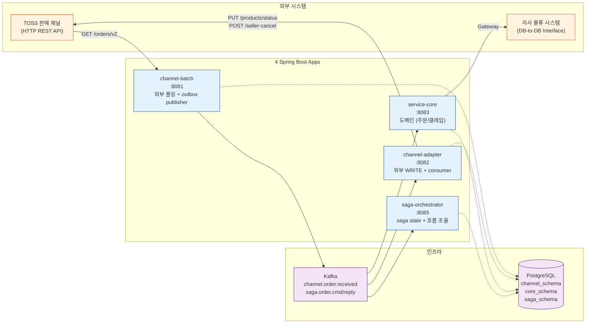
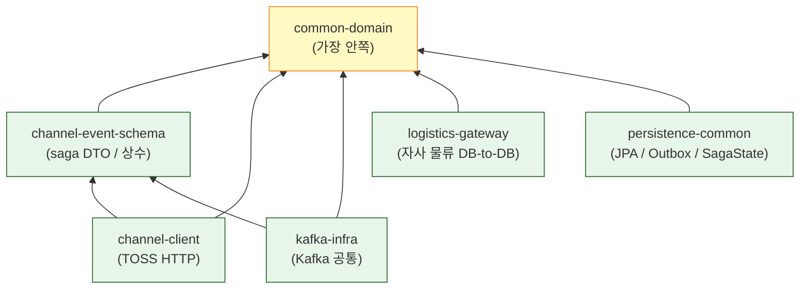
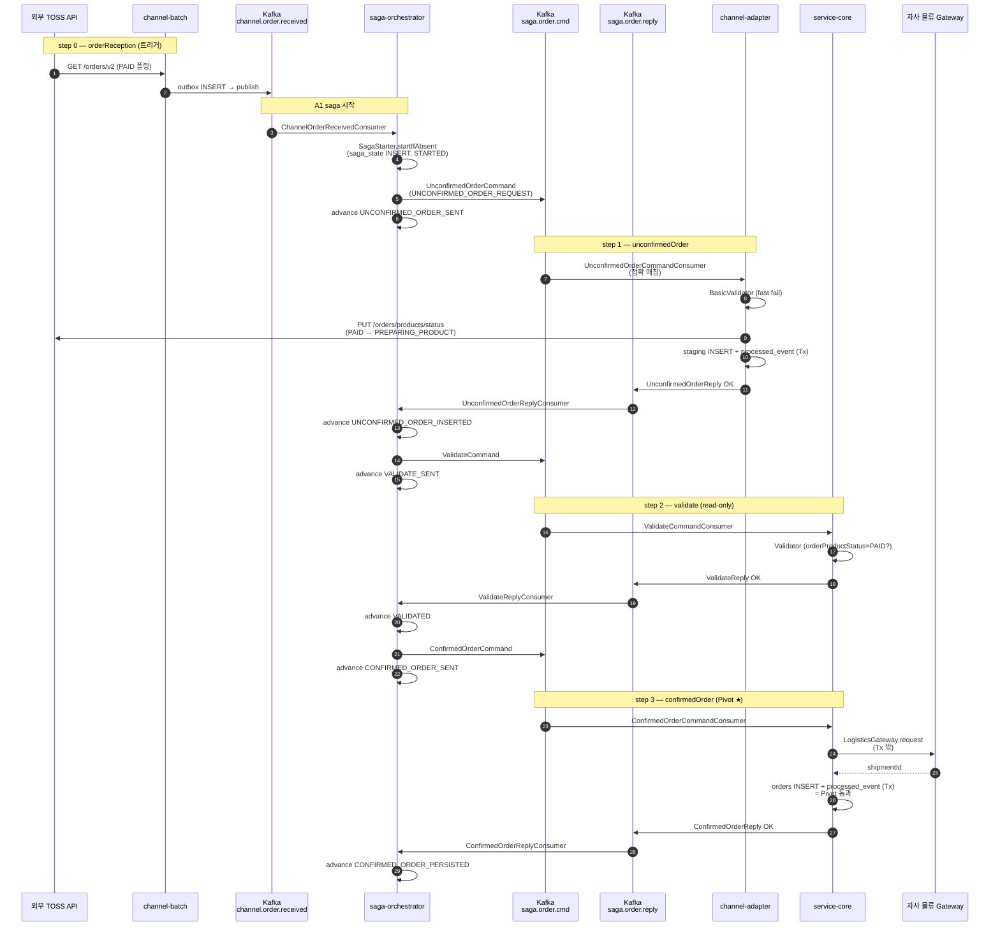
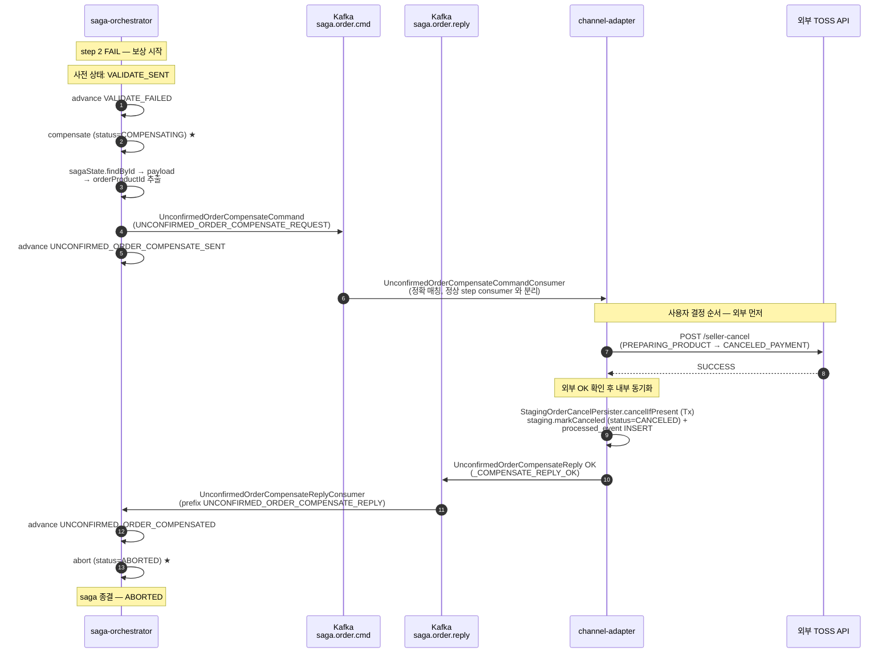

# 모듈 단위 흐름도

본 프로젝트의 4 Spring Boot app + 6 libs 구조를 모듈 단위로 시각화. 각 모듈의 책임 / 통신 / 의존을 한 페이지에서 파악.

관련 결정 메모리:
- `project_pcm_4app_architecture_decision.md` (구조)
- `project_pcm_flow_only_topics.md` (Kafka 토픽 구조)
- `project_pcm_logistics_gateway_naming.md` (Gateway 결정)
- `project_pcm_saga_pivot_compensation_summary.md` (Pivot / 보상)

---

## 1. App 구성 (4 Spring Boot) + 책임

### App 별 책임 매트릭스

| App | 외부 통신 | DB schema (owner) | Kafka 역할 | saga 책임 |
|---|---|---|---|---|
| **channel-batch** | TOSS GET (READ) | channel_schema (owner) | producer (`channel.order.received`) | A1 트리거 (saga 외부) |
| **channel-adapter** | TOSS PUT/POST (WRITE) | channel_schema (read-only) | consumer (`saga.order.cmd` 일부) + publisher (`saga.order.reply`) | step 1 정상 + step 1 보상 |
| **service-core** | 자사 물류 Gateway | core_schema (owner) | consumer (`saga.order.cmd` 일부) + publisher (`saga.order.reply`) | step 2 validate + step 3 Pivot |
| **saga-orchestrator** | — | saga_schema (owner) | consumer (`channel.order.received`, `saga.order.reply`) + publisher (`saga.order.cmd`) | saga state + 모든 step 조율 + 보상 트리거 |

---

## 2. libs 의존 관계 (6 libs)

### App → libs 의존

| App | common-domain | channel-event-schema | channel-client | kafka-infra | logistics-gateway | persistence-common |
|---|---|---|---|---|---|---|
| channel-batch | ✓ | ✓ | ✓ | ✓ | | ✓ |
| channel-adapter | ✓ | ✓ | ✓ | ✓ | | ✓ |
| service-core | ✓ | ✓ | | ✓ | ✓ | ✓ |
| saga-orchestrator | ✓ | ✓ | | ✓ | | ✓ |

### 의존 규칙 (ArchUnit 강제 예정)
- `services/*` → `libs/*` 만
- `libs/*` → 다른 `libs/*` 만 (services 의존 금지)
- `services/*` 간 직접 의존 금지 — Kafka 통신만

---

## 3. A1 saga — 모듈 간 sequence (정상 흐름)

---

## 4. A1 saga 보상 흐름 (Round B — step 2 FAIL 시)

**보상 순서 (사용자 결정)** — 외부가 진실 소스
1. 외부 seller-cancel API
2. 성공 시 내부 staging UPDATE 동기화
3. 외부 실패 시 reply FAIL → saga 가 COMPENSATING 유지 (재시도 / 수동 개입)

---

## 5. DB schema 책임

| Schema | Owner App | 사용 App | 주요 테이블 |
|---|---|---|---|
| `channel_schema` | channel-batch | channel-batch (write), channel-adapter (write) | outbox, polling_cursor, staging_order, processed_event |
| `core_schema` | service-core | service-core (write) | orders, processed_event |
| `saga_schema` | saga-orchestrator | saga-orchestrator (write) | saga_state |

**정책**:
- Owner 가 Flyway migration 수행. 다른 service 는 `flyway.enabled: false` + JPA `validate`
- `processed_event` 는 schema 명시 없는 JPA Entity 로 공유. 각 service 의 `hibernate.default_schema` 따라 channel_schema / core_schema 에 별도 테이블

---

## 6. 외부 통신 매트릭스

| 외부 시스템 | App | 통신 방식 | 사용처 (saga step) | Mock 위치 |
|---|---|---|---|---|
| TOSS GET /orders/v2 | channel-batch | HTTP READ | step 0 (트리거) | `MockTossOrderClient` (channel-batch) |
| TOSS PUT /products/status | channel-adapter | HTTP WRITE | step 1 (PAID→PREPARING) | `MockTossOrderStatusClient` (channel-adapter) |
| TOSS POST /seller-cancel | channel-adapter | HTTP WRITE | step 1 보상 (→ CANCELED_PAYMENT) | `MockTossOrderCancelClient` (channel-adapter) |
| 자사 물류 | service-core | DB-to-DB (Gateway) | step 3 (Pivot) | `MockLogisticsGateway` (service-core) |

---

## 7. Round 진행 요약 (구현 현황)

| Round | 범위 | 상태 |
|---|---|---|
| Phase 0 | 4 app + 5 libs 골격 | ✅ |
| Phase 4 ① ~ ⑥ | Flyway / Outbox / Publisher / Consumer / saga state | ✅ |
| Phase 4 ⑦ | step 1 saga command/reply 흐름 | ✅ |
| Saga 재정의 | A1 4 step + B1 분리 | ✅ |
| flow only 토픽 | saga.order.cmd/reply 두 토픽 통합 | ✅ |
| step 2 validate | service-core 합류 | ✅ |
| step 3 confirmedOrder | service-core Pivot 통과 | ✅ |
| step 1 확장 | BasicValidator + 외부 PREPARING_PRODUCT | ✅ |
| LocalDateTime migration | Instant + TIMESTAMPTZ → LocalDateTime + TIMESTAMP | ✅ |
| LogisticsGateway 분리 | 6 libs 로 확장 | ✅ |
| Round B 보상 | step 2 FAIL → 외부 cancel + staging UPDATE → ABORTED | ✅ |
| Pivot 직전 자동 cancel | step 3 부분 실패 시 외부 cancel | 🟡 계획 |
| B1 sendInvoice | 물류 회신 saga | 🟡 계획 |
| B2 취소 saga | Pivot 이후 사용자 취소 | 🟡 계획 |
| outbox 통합 | saga reply 발행 + 보상 outbox 화 | 🟡 계획 |
| 다채널 지원 | saga state 채널 컬럼 / Strategy | 🟡 계획 |
