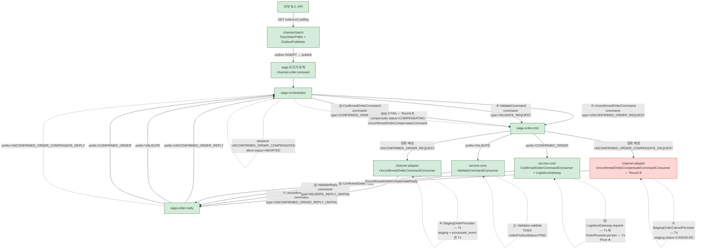
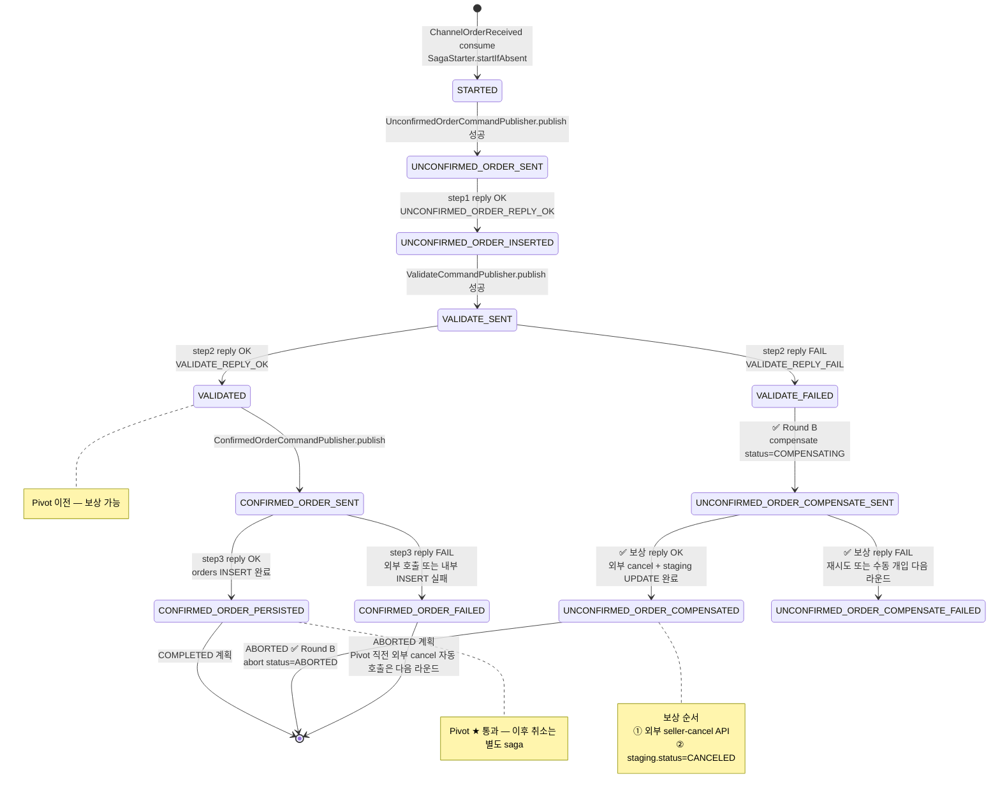
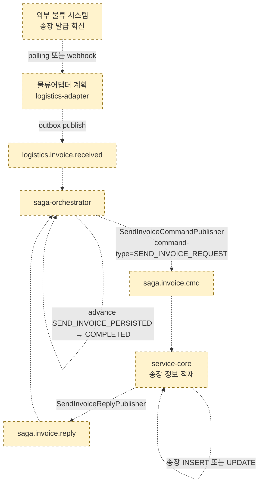

# Saga 프로세스 순서도

지금까지 결정된 사항을 종합한 saga 전체 흐름. 현재 구현 상태와 계획 / 다음 라운드 후보를 같이 표시.

관련 결정 메모리:
- `project_pcm_saga_redefinition.md` (saga 구조 — A1 4 step + B1 분리)
- `project_pcm_flow_only_topics.md` (토픽 — flow only + header filter)
- `project_pcm_phase4_step7_saga_step1.md` (step 1 unconfirmedOrder 구현)
- `project_pcm_step2_validate.md` (step 2 validate 구현)
- `project_pcm_localdatetime_migration.md` (시각 타입 정책)

---

## 1. 토픽 / 라우팅 매트릭스

| 토픽 | 분류 | 발행자 | 소비자 | command-type filter |
|---|---|---|---|---|
| `channel.order.received` | 도메인 이벤트 (A1 트리거) | channel-batch (OutboxPublisher) | saga-orchestrator (`ChannelOrderReceivedConsumer`) | (filter 없음) |
| `saga.order.cmd` | A1 saga command (flow only) | saga-orchestrator | channel-adapter `UnconfirmedOrderCommandConsumer` | **정확** `UNCONFIRMED_ORDER_REQUEST` |
| | | | service-core `ValidateCommandConsumer` | prefix `VALIDATE` |
| | | | service-core `ConfirmedOrderCommandConsumer` | prefix `CONFIRMED_ORDER` |
| | | | channel-adapter `UnconfirmedOrderCompensateCommandConsumer` ✅ Round B | **정확** `UNCONFIRMED_ORDER_COMPENSATE_REQUEST` |
| `saga.order.reply` | A1 saga reply (flow only) | channel-adapter `UnconfirmedOrderReplyPublisher` | saga-orchestrator `UnconfirmedOrderReplyConsumer` | prefix `UNCONFIRMED_ORDER_REPLY` |
| | | service-core `ValidateReplyPublisher` | saga-orchestrator `ValidateReplyConsumer` | prefix `VALIDATE` |
| | | service-core `ConfirmedOrderReplyPublisher` | saga-orchestrator `ConfirmedOrderReplyConsumer` | prefix `CONFIRMED_ORDER` |
| | | channel-adapter `UnconfirmedOrderCompensateReplyPublisher` ✅ Round B | saga-orchestrator `UnconfirmedOrderCompensateReplyConsumer` | prefix `UNCONFIRMED_ORDER_COMPENSATE_REPLY` |
| `logistics.invoice.received` (계획) | 도메인 이벤트 (B1 트리거) | 물류어댑터 (polling/webhook) | saga-orchestrator | — |
| `saga.invoice.cmd` (계획) | B1 saga command | saga-orchestrator | service-core | `SEND_INVOICE_REQUEST` |
| `saga.invoice.reply` (계획) | B1 saga reply | service-core | saga-orchestrator | prefix `SEND_INVOICE` |

> **flow only + 정확 매칭** — `UNCONFIRMED_ORDER_COMPENSATE_*` 가 `UNCONFIRMED_ORDER_*` 의 prefix 도 매칭 → 충돌 회피 위해 정확 매칭 / 더 긴 prefix 사용.

---

## 2. A1 saga 전체 프로세스 (구현 + 계획)

**범례**
- 실선 / 초록: 구현 완료
- 점선 / 노랑: 계획 (다음 라운드)

---

## 3. A1 saga_state.currentStep 전이도

**stuck 시나리오 (학습 단계 acceptable — 다음 라운드 outbox 통합으로 해소)**
- `STARTED` 에서 stuck: UnconfirmedOrderCommandPublisher 발행 실패
- `UNCONFIRMED_ORDER_SENT` 에서 stuck: channel-adapter reply 발행 실패
- `UNCONFIRMED_ORDER_INSERTED` 에서 stuck: ValidateCommandPublisher 발행 실패
- `VALIDATE_SENT` 에서 stuck: service-core reply 발행 실패
- `VALIDATED` 에서 stuck: ConfirmedOrderCommandPublisher 발행 실패
- `UNCONFIRMED_ORDER_COMPENSATE_FAILED` — 외부 cancel 실패. saga COMPENSATING 유지, 재시도 / 수동 개입 (다음 라운드)

---

## 4. B1 saga (sendInvoice) — 계획

**A1 ↔ B1 연결**: `correlationKey = 외부 orderProductId` (A1 과 같음). B1 saga 인스턴스는 A1 종료와 무관한 별도 인스턴스. UI / 운영 도구에서 같은 correlationKey 로 join 하여 lifecycle 한눈에 봄.

---

## 5. 구현 / 계획 요약

| Step | Saga | 책임 서비스 | 상태 | 비고 |
|---|---|---|---|---|
| 0. orderReception | A1 트리거 | channel-batch | ✅ 완료 | TossOrderPoller + outbox publisher |
| 1. unconfirmedOrder | A1 | channel-adapter | ✅ 완료 | BasicValidator + TossOrderStatusClient (PAID→PREPARING_PRODUCT) + staging INSERT. 보상은 Round B |
| 2. validate | A1 | service-core | ✅ 완료 | TOSS PAID 룰만, 다채널 미지원 |
| 3. confirmedOrder | A1 (Pivot) | service-core (LogisticsClient) | ✅ 완료 | Mock 물류 + orders INSERT. COMPLETED 전이는 다음 라운드 |
| 1. sendInvoice | B1 | service-core | 🟡 계획 | 물류 회신 처리 |
| step 1 보상 | A1 (step 2 FAIL 트리거) | channel-adapter | ✅ Round B | TossOrderCancelClient (PREPARING→CANCELED_PAYMENT) + staging.status=CANCELED. saga COMPENSATING→ABORTED |
| Pivot 직전 자동 cancel | A1 (step 3 부분 실패) | channel-adapter / service-core | 🟡 계획 | 외부 OK + 내부 INSERT 실패 시 cancel 호출 |
| outbox 통합 | A1, B1 saga-orchestrator + channel-adapter + service-core | 🟡 계획 | 발행 stuck 해소 |
| 다채널 지원 | A1, B1 | 전체 | 🟡 계획 | saga state 채널 컬럼 + ChannelStrategy |
