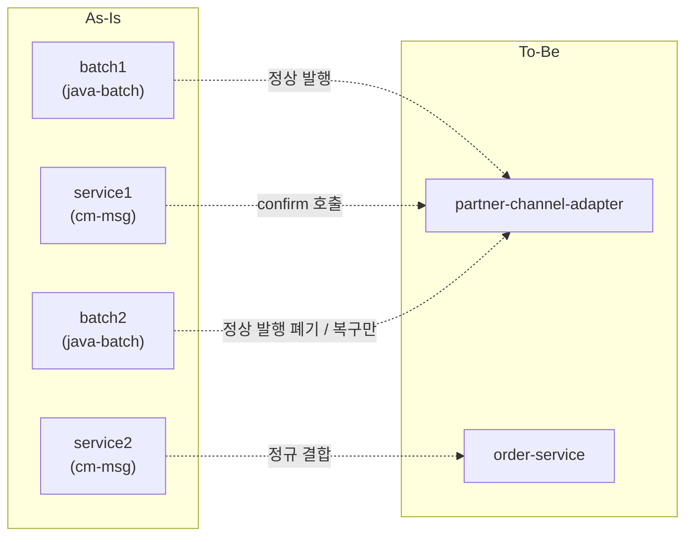
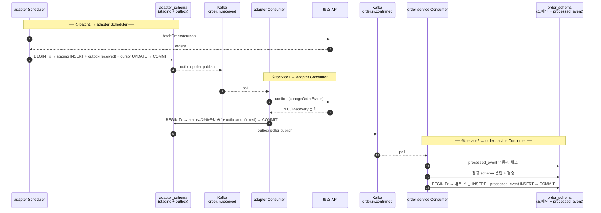

# Application × 업무 매트릭스 (As-Is → To-Be)

- **Status**: 진행 중 — A1 (외부 수신 주문) 흐름만 상세화. 나머지 업무는 매핑 표만.
- **Date**: 2026-06-08
- **목적**: As-Is 의 application 들이 어떤 업무를 어떻게 다루는지, To-Be 의 application 들이 그걸 어떻게 흡수하는지 한눈에 비교.
- **참조**: [docs/as-is/toss-shopping.md](as-is/toss-shopping.md) (업무 카탈로그) · [ADR-0002](adr/0002-service-split.md) (서비스 분할)

---

## 1. As-Is application 구조

### 1.1 Application

| Application | 역할 | 출처 |
|---|---|---|
| `<external-batch-app>` | **batch app** — 폴링 / 외부 수집 / 비정규 schema 발행 | `<sibling: 외부 배치 (참고, 제거됨)>` |
| `<external-msg-app>` | **service app** — Kafka consume / 외부 API 송신 / 정규 schema 처리 | `<sibling: 외부 메시지 처리 (참고, 제거됨)>` |
| `<external-common-lib>` | **library** — Toss Client / 토큰 / RateLimit / Recovery / 이력 | `<sibling: 공통 lib (참고, 제거됨)>` |

### 1.2 Schema 구분

| Schema | 역할 | 예시 테이블 |
|---|---|---|
| **비정규 (staging)** | 외부 시스템 raw 보존 + interface | 주문수신, 클레임수신, 물류 interface |
| **정규 (domain)** | 내부 비즈니스 도메인 데이터 | 내부 주문, 회원 매핑, 상품 매핑 등 |
| **outbox** | 이벤트 발행 보장 (현행에서 batch app 도 사용) | outbox 테이블 |

### 1.3 흐름 추상 모델 (A1 주문 수신 기준)

```
[외부 API]
   │
   ▼
batch1 (batch app)
   ├─ 외부 호출 → 비정규 schema INSERT + outbox INSERT (한 Tx)
   ▼ Kafka publish
service1 (service app)
   ├─ consume → 외부 confirm API 호출 → 비정규 status UPDATE + outbox INSERT (한 Tx)
   ▼ Kafka publish
batch2 (batch app)        ← As-Is 에서는 비정규 상태 폴링 → outbox INSERT → 발행
   ▼ Kafka publish
service2 (service app)
   ├─ consume → 정규 schema 조회/검증 → 내부 주문 적재 (정규 schema)
```

각 단계가 **outbox 기반 발행** + **Kafka 비동기** + **다음 단계 consume**.

---

## 2. To-Be application 구조 (Phase 1 기준)

### 2.1 Application

| Application | 역할 | 비고 |
|---|---|---|
| **partner-channel-adapter** | 채널 ACL — Scheduler / 외부 송신 / 채널 Strategy / 토큰 · RateLimit · Recovery · 이력 | Multi-tenant. As-Is 의 batch1 + service1 + batch2 일부 흡수 |
| **order-service** | 주문 도메인 — A1·A2·A3 + 취소 적용 | As-Is service2 일부 + 도메인 확장 |
| **claim-service** | 클레임 도메인 — B1·B2·B3·B4 | As-Is service 의 클레임 부분 |
| **fulfillment-service** | 물류 도메인 — A4·A5·A6·A7 | As-Is service 의 물류 부분 |
| **saga-orchestrator** | 상태머신 + 보상 트리거 | 신규 (현행 없음) |

### 2.2 Schema 구분 (옵션 A — 같은 DB, schema 분리)

| Schema | 소속 | 역할 |
|---|---|---|
| `adapter_schema` | partner-channel-adapter | 비정규 staging + outbox + cursor + 채널 메타 |
| `order_schema` | order-service | 정규 주문 도메인 + processed_event + outbox |
| `claim_schema` | claim-service | 정규 클레임 도메인 + processed_event + outbox |
| `fulfillment_schema` | fulfillment-service | 정규 물류 도메인 + processed_event + outbox |
| `saga_schema` | saga-orchestrator | saga state + outbox |

---

## 3. As-Is ↔ To-Be application 매핑 (개념)



- As-Is 의 batch1·service1·batch2 → **partner-channel-adapter** 안의 컴포넌트로 통합
- As-Is 의 service2 → **order-service / claim-service / fulfillment-service** 로 분기 (도메인 기준)
- As-Is 의 batch2 의 "정상 발행" 책임은 outbox 가 대체 → **Recovery Batch** 로 의미만 좁아짐

---

## 4. A1 — 외부 수신 주문 (상세)

이번 라운드 합의 영역. As-Is 4 단계가 To-Be 의 2 application 으로 재구성.

### 4.1 As-Is

| 단계 | App | 책임 | Schema / 테이블 |
|---|---|---|---|
| batch1 | java-batch | 토스 API 폴링 → 비정규 INSERT + outbox INSERT (한 Tx) → cursor UPDATE | 비정규(주문수신) + outbox |
| service1 | cm-msg | consume → 토스 confirm API → 비정규 status='상품준비중' UPDATE + outbox INSERT (한 Tx) | 비정규 + outbox |
| batch2 | java-batch | 비정규 '상품준비중' 폴링 → outbox INSERT → 발행 | 비정규 + outbox |
| service2 | cm-msg | consume → 정규 결합/검증 → 내부 주문 INSERT | 정규(내부 주문) |

### 4.2 To-Be

| 단계 | App | 책임 | Schema |
|---|---|---|---|
| ① Scheduler | adapter | 토스 API 폴링 → staging INSERT + outbox(`received`) + cursor UPDATE — 한 Tx | adapter_schema |
| ② Adapter Consumer | adapter | consume `order.in.received` → 토스 confirm API → staging status UPDATE + outbox(`confirmed`) — 한 Tx | adapter_schema |
| ③ Recovery Batch | adapter | staging 미발행/미confirm 잔재 폴링 → 재발행 (안전망) | adapter_schema |
| ④ Order Consumer | order-service | consume `order.in.confirmed` → 멱등성 → order_schema 결합/검증 → 내부 주문 INSERT + processed_event — 한 Tx | order_schema |

### 4.3 단계 매핑

| As-Is 단계 | To-Be 위치 | 처리 |
|---|---|---|
| batch1 (정상 발행) | adapter Scheduler (①) | 코드 재작성 ([[feedback_pattern_vs_rules]]) |
| service1 (confirm + 상태변경) | adapter Consumer (②) | 코드 재작성, Strategy 분기 적용 |
| batch2 (정상 발행) | **삭제** — outbox 가 대체 | 폐기 |
| batch2 (복구) | adapter Recovery Batch (③) | 의미 변경, 재작성 |
| service2 (정규 결합 + 적재) | order-service Consumer (④) | 신규 서비스, 재작성 |

### 4.4 Kafka 토픽

| 토픽 | Producer | Consumer | 페이로드 원칙 |
|---|---|---|---|
| `order.in.received` | adapter Scheduler | adapter Consumer | 외부 raw + afcnCode (ACL 정규화) |
| `order.in.confirmed` | adapter Consumer | order-service | 비정규 row 식별자 + 상품준비중 상태 + 정규화된 외부 데이터 |
| `order.events.out` (후속) | order-service | 다음 단계 / Saga / 후행 코레오 | 도메인 사실 |

### 4.5 흐름



`③ Recovery Batch` 는 평상시에 동작하지 않음 — outbox 실패 / staging 잔재 정리 시에만.

---

## 5. As-Is application × 전체 업무 (요약)

19개 업무의 As-Is application 매핑. 상세는 [docs/as-is/toss-shopping.md](as-is/toss-shopping.md).

| # | 업무 | batch app (java-batch) | service app (cm-msg) | 비고 |
|---|---|---|---|---|
| A1 | 주문 수신 (신규) | TssOrderScheduler.tssSearchOrder | TssOrderReceptionService | 이번 라운드 상세 |
| A2 | 주문 WAIT 회복 | TssOrderScheduler.tssRetryWaitOrder | (해당 없음 — batch 가 직접 발행) | |
| A3 | EOI → EOH 등록 | — | EohRegistrationService (공통) | |
| A4 | 송장 등록 | — | ModifyDeliveryService + TssOrderInvoiceRegistrationApiAdapter | |
| A5 | 발송지연 통보 | OrderScheduler.deliveryDelayProcess | TssOrderDelaySendApiAdapter | |
| A6 | 자동품절 통보 | OrderScheduler.autoSoldOut | SoldoutService + TssSellerCancelApiOutAdapter | |
| A7 | BCT 연동 / 매출 | — | SendOrderToBctService / SaleRegistrationService | |
| B1 | 클레임 폴링 | TssOrderScheduler.tssSearchClaim | — | |
| B2 | 취소 처리 | OrderScheduler.cancelClaim | TssReceiveClmService + CancelReqService + Tss(Cancel)*Adapter | |
| B3 | 반품 처리 | OrderScheduler.returnExchangeClaim | TssReceiveClmService + ClaimReqService + Tss(Return)*Adapter + Return*Service | |
| B4 | 교환 처리 | OrderScheduler.returnExchangeClaim | TssReceiveClmService + Tss(Exchange)*Adapter + Exchange*Service | |
| C1~C5 | 횡단 (토큰 / RateLimit / ErrorDecoder / Recovery / 이력) | (공통 lib 사용) | (공통 lib 사용) | <external-common-lib> 소속 |

---

## 6. To-Be application × 전체 업무 (요약)

| # | 업무 | adapter | order-svc | claim-svc | fulfillment-svc | saga-orch |
|---|---|---|---|---|---|---|
| A1 | 주문 수신 (신규) | ① 폴링 ② confirm ③ recovery | ④ 정규 결합·적재 | | | (다음 단계 조율) |
| A2 | 주문 WAIT 회복 | 회복 폴링 | 회복 적재 | | | |
| A3 | 내부 주문 등록 | | EOH 등록 도메인 | | | |
| A4 | 송장 등록 | 외부 송신 (Strategy) | | | 도메인 처리 | step 조율 |
| A5 | 발송지연 통보 | 외부 송신 (Strategy) | | | 도메인 처리 | step 조율 |
| A6 | 자동품절 통보 | 외부 송신 (Strategy) | | | 도메인 처리 | step 조율 |
| A7 | BCT 연동 / 매출 | | | | 도메인 처리 | step 조율 |
| B1 | 클레임 폴링 | ① 폴링 ② raw 적재 | | ③ 정규 결합·적재 | | |
| B2 | 취소 처리 | 외부 송신 (Strategy) | 취소 적용 (사내 EOH) | 클레임 처리 | | step + 보상 |
| B3 | 반품 처리 | 외부 송신 (Strategy) | | 클레임 처리 (다단계) | (반품 완료 시 물류 연계) | step + 보상 |
| B4 | 교환 처리 | 외부 송신 (Strategy) | | 클레임 처리 (다단계) | (교환 재배송 시 물류 연계) | step + 보상 |
| C1~C5 | 횡단 | adapter 내장 + `libs/toss-client/` | | | | |

---

## 7. 다음 라운드 상세화 대기

A1 외 업무의 상세 매핑은 다음 라운드에서 같은 형식으로 풀어냅니다.

- A2 회복 흐름의 To-Be 상세
- A4 송장 등록 — fulfillment vs adapter 책임 분배 + Saga 연계
- B1·B2·B3·B4 클레임 흐름 — 다단계 + REVOKED 철회 + 보상
- C 횡단 — `libs/toss-client/` 패키지 분리 / `libs/kafka/` / `libs/common-domain/`

---

## 8. References

- [docs/as-is/toss-shopping.md](as-is/toss-shopping.md) — 업무 카탈로그 + 우선 영역 시퀀스
- [docs/adr/0001-saga-style.md](adr/0001-saga-style.md) — SAGA 스타일
- [docs/adr/0002-service-split.md](adr/0002-service-split.md) — 서비스 분할 + ChannelStrategy
- Chris Richardson, *Microservices Patterns* (2018) Ch.3 (Outbox / Idempotent Consumer) · Ch.4 (Saga)
- Martin Fowler — Event-Carried State Transfer (ECST)
